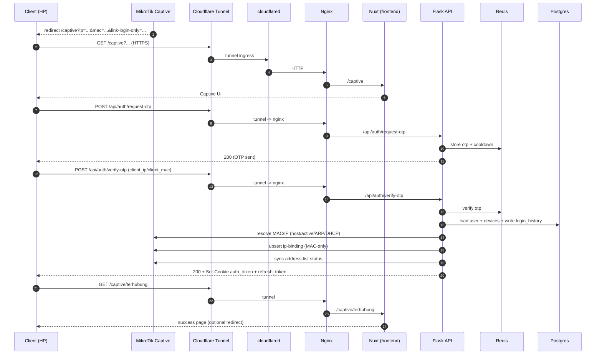
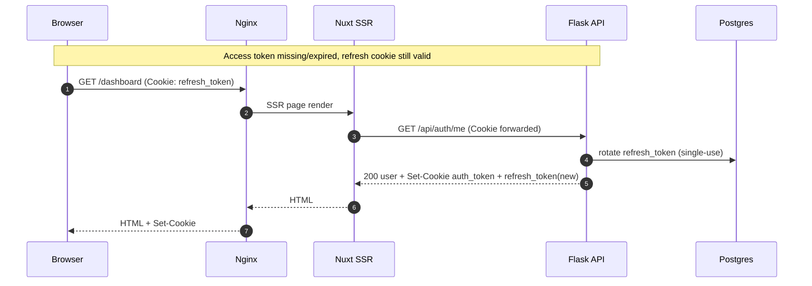
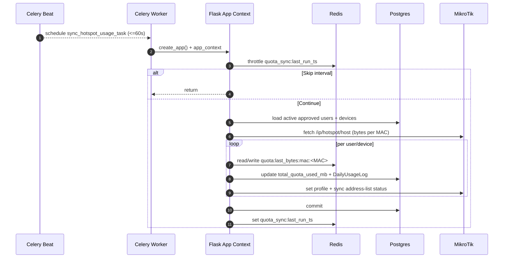

# Architecture Diagrams (lpsaring)

Lampiran wajib:
- [.github/copilot-instructions.md](../.github/copilot-instructions.md)

Dokumen ini berisi diagram (Mermaid) saja, khusus untuk memvisualisasikan flow dan topology produksi.

---

## 1) Production Topology (Docker Compose)

```mermaid
flowchart LR
  U[Client Device\nHP/Laptop] -->|HTTPS| CF[Cloudflare Zero Trust\nTunnel Public Hostname]
  CF -->|tunnel ingress\nhttp://hotspot_nginx_proxy:80| FL[cloudflared\nservice: cloudflared]

  subgraph NET[Docker network: hotspot_prod_net]
    NX[nginx\nservice: nginx\nalias: hotspot_nginx_proxy]
    FE[nuxt\nservice: frontend\n:3010]
    BE[flask\nservice: backend\n:5010]
    CW[celery worker\nservice: celery_worker]
    CB[celery beat\nservice: celery_beat]
    RD[redis\nservice: redis]
    PG[postgres\nservice: db]
    BI[init backups perm\nservice: backups_init]
    MG[db migrate\nservice: migrate]
  end

  FL --> NX

  NX -->|/ (SSR/SPA)| FE
  NX -->|/api/*| BE

  BE <--> RD
  BE <--> PG
  CW <--> RD
  CW <--> PG
  CB <--> RD
  CB <--> PG

  BI --> BE
  MG --> BE

  BE -->|RouterOS API| MT[(MikroTik)]
  BE -->|HTTP| WA[(WhatsApp Gateway)]
  BE -->|HTTP webhook| MID[(Midtrans)]

  NX -->|vhost wartelpas.sobigidul.com\nproxy_pass http://10.10.83.2:8081| WP[(Wartelpas :8081)]
```

---

## 2) Nginx Routing (Prod)

```mermaid
flowchart TB
  R[Incoming request\n(port 80 inside Docker)] --> NX[Nginx\napp.prod.conf]

  NX -->|Host: lpsaring.*\nPath: /api/*| BE[backend:5010]
  NX -->|Host: lpsaring.*\nPath: /_nuxt/*| FE[frontend:3010]
  NX -->|Host: lpsaring.*\nPath: /*| FE

  NX -->|Host: wartelpas.sobigidul.com\nPath: /*| WP[10.10.83.2:8081]

  NX -.->|sets headers| H[Host, X-Real-IP,\nX-Forwarded-For,\nX-Forwarded-Proto,\nX-Request-ID]
```

---

## 3) Captive → OTP → Binding (End-user)



---

## 4) Auth Cookie Auto-Refresh (Rotating Refresh Token)



---

## 5) Quota Sync (Celery Beat)


